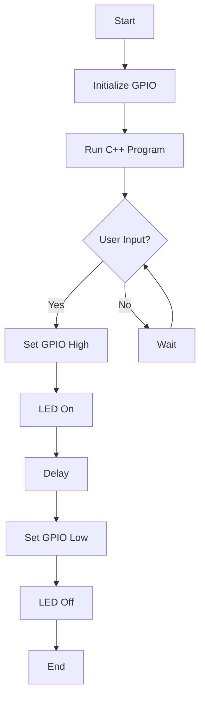

# Pi-LED
RaspberryPi 5 LED
This serves as a first project on Github to gain a better understanding of how to use this enviroment. 

```mermaid
flowchart TD
    A[Start] --> B[Initialize GPIO]
    B --> C[Run C++ Program]
    C --> D{User Input?}
    D -- Yes --> E[Set GPIO High]
    D -- No --> F[Wait]
    E --> G[LED On]
    G --> H[Delay]
    H --> I[Set GPIO Low]
    I --> J[LED Off]
    J --> K[End]
    F --> D
```
